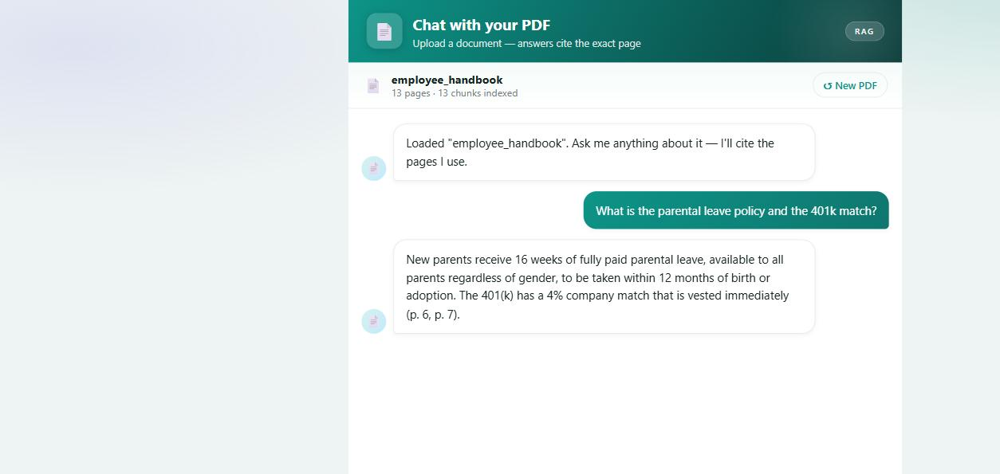

# Chat with your PDF 📄

Upload a PDF and ask questions about it. Answers are **grounded in the document** and
**cite the pages** they came from — and if the answer isn't in the file, it says so
instead of guessing. Real retrieval-augmented generation (RAG), not "paste the whole
thing into the prompt."

> Project **#3** of my *"30 AI Projects in 15 Days"* build-in-public challenge.

**▶ Live demo: https://pdf.gritai.solutions**



## How it works (the RAG pipeline)
1. **Extract** — pull text per page from the PDF (`pypdf`).
2. **Chunk** — split into overlapping passages, each tagged with its page number.
3. **Embed** — encode chunks with `fastembed` (BAAI/bge-small, ONNX/CPU — no GPU, no torch).
4. **Retrieve** — embed the question, cosine-rank the chunks, take the top matches.
5. **Answer** — Claude answers using only those excerpts and cites pages like `(p. 4)`.

## What it demonstrates
- **RAG fundamentals** — chunking, embeddings, vector similarity search, grounded generation.
- **Faithful, cited answers** — refuses to answer when the document doesn't cover it.
- **Lightweight + self-hosted embeddings** — no embedding API key required.
- **Streaming UX** and a drag-and-drop single-file interface.

## Try it with the sample PDFs
`sample_pdfs/` has four documents of increasing complexity to test with:
`simple_memo.pdf` · `product_manual.pdf` · `research_report.pdf` · `employee_handbook.pdf`.

## Run locally
```bash
pip install -r requirements.txt
export ANTHROPIC_API_KEY=sk-ant-...      # or set OLLAMA_URL / OLLAMA_MODEL
python app.py                            # http://127.0.0.1:8500
```

## Deploy (always-on)
Ships with a `Dockerfile` — works on **Hugging Face Spaces**, Render, Railway, or Fly.io.
Set `ANTHROPIC_API_KEY` (+ optional `ANTHROPIC_MODEL=claude-haiku-4-5`) as a secret.

---
Built by **Robert Lucyk** · [GritAI Solutions](https://gritai.solutions) · part of the 30-in-15 challenge.
